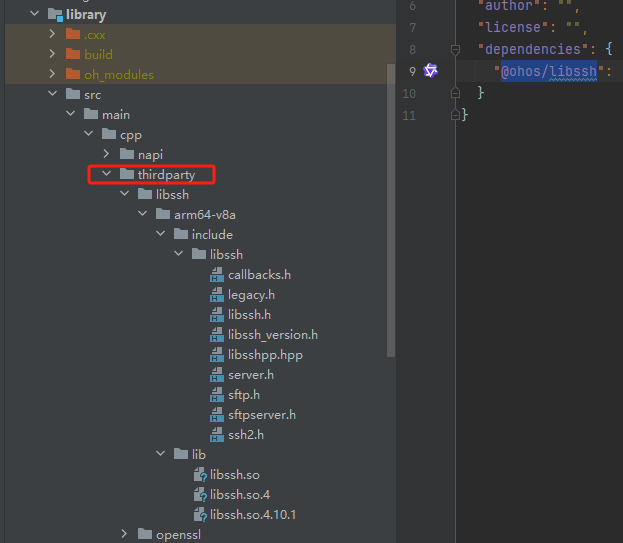

# ohos_ssh

## 介绍
基于 libssh-0.11.1 C++库封装的一个支持SFTP服务端以及SSH客户端的鸿蒙三方库。

## 下载安装

```shell
ohpm install @ohos/libssh
```
- OpenHarmony ohpm环境配置等更多内容，请参考 [如何安装OpenHarmony ohpm包](https://gitcode.com/openharmony-tpc/docs/blob/master/OpenHarmony_har_usage.md) 。

### 编译运行

本项目依赖openssl、libssh库，需要自行编译[openssl、libssh集成到应用hap](https://gitcode.com/openharmony-sig/tpc_c_cplusplus/blob/master/lycium/README.md)。

1.编译之前将[doc目录](doc)下的文件拷贝到tpc_c_cplusplus/thirdparty下。

2.开始编译openssl、libssh。

```shell
 # 在lycium目录执行
 build.sh openssl-3.5.4
 build.sh libssh
```

3.在cpp目录下新增thirdparty目录，并将编译生成的库拷贝到该目录下，如下图所示：



## 使用说明

### 生成公私钥

```typescript
import { libssh, SSH_KEYTYPES } from '@ohos/libssh';
......
this.ssh2Napi = new libssh();
let result = this.ssh2Napi.keygen(this.privateKeyPath, this.publicKeyPath, SSH_KEYTYPES.SSH_KEYTYPE_ECDSA);
......
```

### 设置用户信息
```typescript
import { libssh, SSH_KEYTYPES } from '@ohos/libssh';
......
this.ssh2Napi = new libssh();
let result = this.ssh2Napi.setUser(this.username, this.password);
......
```

### 设置算法相关

```typescript
import { libssh, SSH_KEYTYPES } from '@ohos/libssh';
......
this.ssh2Napi = new libssh();
let result = this.ssh2Napi.setSFTPKeyexChangeCer("curve25519-sha256")
result = this.ssh2Napi.setSFTPServerCer("aes256-ctr,aes128-ctr,aes192-ctr")
result = this.ssh2Napi.setSFTPMessageCer("hmac-sha2-512,hmac-sha2-265")
......
```

### 启动SFTP服务端

```typescript
import { libssh, SSH_KEYTYPES } from '@ohos/libssh';
......
let callback = (type: number) => {
  if (type == 2) {
    console.log("sftp启动成功")
  } else if (type == 3) {
    console.log("sftp启动失败")
  } else if (type == 4) {
    console.log("sftp客户端连接服务成功")
  } else if (type == 5) {
    console.log("停止sftp服务成功、断开连接")
  }
}
this.ssh2Napi.setUser(this.username, this.password);
//若在sftp服务端设置多个用户请执行多次setUser
// this.ssh2Napi.setUser("test", "test123");
this.ssh2Napi.startSFTPServer(this.privateKeyPath, this.publicKeyPath, this.port, callback);
......
```

### 停止SFTP服务端

```typescript
import { libssh, SSH_KEYTYPES } from '@ohos/libssh';
......
this.ssh2Napi = new libssh();
//注意停止sftp服务是异步的在startSFTPServer接口回调type=5即停止成功
let result = this.ssh2Napi.stopSFTPServer();
......
```

### 启动SSH客户端

```typescript
import { libssh, SSH_KEYTYPES } from '@ohos/libssh';
......
this.ssh2Napi = new libssh();
let callback = (type: number) => {
  if (type == 0) {
    console.log("sshClient启动成功")
  } else {
    console.log("sshClient启动失败，请先setUser或检查sshServer服务是否正常ping通")
  }
}
this.ssh2Napi.startSSHClient(this.sshServerIP, this.port, this.privateKeyPath, callback);
......
```

### 停止SSH客户端

```typescript
import { libssh, SSH_KEYTYPES } from '@ohos/libssh';
......
this.ssh2Napi = new libssh();
let result = this.ssh2Napi.stopSSHClient();
......
```

### 创建SSH客户端伪终端

```typescript
import { libssh, SSH_KEYTYPES } from '@ohos/libssh';
......
this.ssh2Napi = new libssh();
let result = this.ssh2Napi.createShell()
......
```

### 在SSH客户端上下发指令

```typescript
import { libssh, SSH_KEYTYPES } from '@ohos/libssh';
......
this.ssh2Napi = new libssh();
this.ssh2Napi.executeSSHComm(this.command).then((result) => {
  console.log("executeSSHComm result: " + result)
});
......
```

### 获取公钥指纹信息

```typescript
import { libssh, SSH_KEYTYPES } from '@ohos/libssh';
......
this.ssh2Napi = new libssh();
let result = await this.ssh2Napi.getPublicKeyFingerprint(this.publicKeyPath);
......
```

## 接口说明

| 接口  | 参数   | 参数说明                                                                | 返回值                         | 接口说明                    |
| ----------------------- | ------------------------------------------------------------ | ------------------------------------------------------------ | :----------------------------- | --------------------------- |
| keygen                  | privateKeyPath:string, publicKeyPath::string, type:SSH_KEYTYPES | 参数1：私钥生成路径；<br/>参数2：公钥生成路径；<br/>参数3：秘钥生成算法 | number 类型：0：成功；1失败    | 生成公钥私钥 |
| setUser                 | name:string,psw:string                                       | 参数1：用户名<br/>参数2：用户密码                            | number 类型：0：成功；1失败    | 设置用户信息              |
| setSFTPKeyexChangeCer   | cer:string                                                   | c参数1：支持的秘钥算法集，中间用逗号隔开                     | number 类型：0：成功；1失败    | 设置秘钥交换支持的算法 |
| setSFTPServerCer        | cer:string                                                   | 参数1：支持的加密算法集，中间用逗号隔开                      | number 类型：0：成功；1失败    | 设置SFTP服务端支持的加密算法 |
| setSFTPMessageCer       | cer:string                                                   | 参数1：支持的消息认证算法集，中间用逗号隔开                  | number 类型：0：成功；1失败    | 设置消息认证支持的算法     |
| startSFTPServer         | privateKeyPath: string, publicKeyPath: string, port: number,callback:Function | 参数1：私钥存放的路径<br/>参数2：公钥存放的路径<br/>参数3：端口号<br/>参数4：callback回调 | callback回调： let callback = (type: number) => {<br/>      if (type == 2) {<br/>        console.log("sftp启动成功")<br/>      } else if (type == 3) {<br/>        console.log("sftp启动失败")<br/>      } else if (type == 4) {<br/>        console.log("sftp客户端连接服务成功")<br/>      } else if (type == 5) {<br/>        console.log("停止sftp服务成功、断开连接")<br/>      }<br/>    } | 启动sftp服务器 |
| startSSHClient          | ip: string, port: number, privateKeyPath: string,callback:Function | 参数1：SSH服务端地址ip<br/>参数2：端口号<br/>参数3：私钥存放的路径<br/>参数4：callback回调 | callback回调：    <br/>let callback = (type: number) => {<br/>      if (type == 0) {<br/>        console.log("sshClient启动成功")<br/>      } else {<br/>        console.log("sshClient启动失败，请先setUser或检查sshServer服务是否正常ping通")<br/>      }<br/>    } | 启动ssh客户端   |
| executeSSHComm          | command：string                                              | 参数1：具体指令                                              | Promise<string> | ssh客户端下发指令 |
| stopSFTPServer          | 无                                                           | 无                                                           | number 类型：0：成功；1失败 | 停止sftp服务 |
| stopSSHClient           | 无                                                           | 无                                                           | number 类型：0：成功；1失败 | 停止ssh客户端 |
| getPublicKeyFingerprint | publicKeyPath: string                                        | 参数1：公钥路径                                              | Promise<string> | 获取公钥指纹 |


## 注意事项
- 无论是SFTP服务端还是SSH客户端，前后端的公私钥要对齐。

- 公私钥生成的规则以及各种算法要对齐。

## 关于混淆
- 代码混淆，请查看[代码混淆简介](https://docs.openharmony.cn/pages/v5.0/zh-cn/application-dev/arkts-utils/source-obfuscation.md)。
- 如果希望libssh库在代码混淆过程中不会被混淆，需要在混淆规则配置文件obfuscation-rules.txt中添加相应的排除规则：

```
-keep
./oh_modules/@ohos/libssh
```

## 约束与限制
在下述版本验证通过：

DevEco Studio: DevEco Studio 5.0.3 Beta2- 5.0.9.200, SDK: API12。

## 目录结构
````
|----ohos_ssh  
|     |---- entry  # 示例代码文件夹
|     |---- library  
|                |---- cpp # c/c++和napi代码
|                      |---- napi # ssh的napi逻辑代码
|                      |---- CMakeLists.txt  # 构建脚本
|                      |---- thirdparty # 三方依赖
|                      |---- types # 接口声明
|                      |---- utils # 工具类
|           |---- index.ets  # 对外接口
|     |---- README.md  # 安装使用方法
|     |---- README_zh.md  # 安装使用方法
````

## 贡献代码
使用过程中发现任何问题都可以提 [Issue](https://gitcode.com/openharmony-tpc/openharmony_tpc_samples/issues) 给我们，当然，我们也非常欢迎你给我们发 [PR](https://gitcode.com/openharmony-tpc/openharmony_tpc_samples/pulls) 。

## 开源协议
本项目基于 [GNU - v 2.1](https://gitcode.com/openharmony-tpc/openharmony_tpc_samples/blob/master/ohos_ssh/LICENSE) ，请自由地享受和参与开源。 
    


